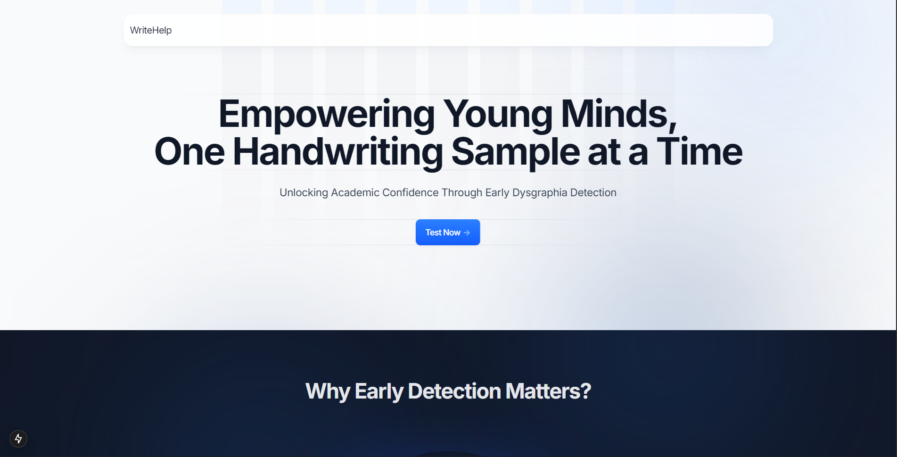
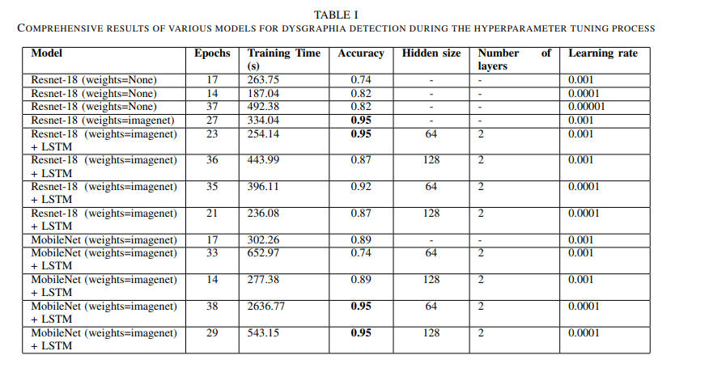

# Dysgraphia Detection Web Platform

An advanced web application for automated dysgraphia screening using deep learning and generative AI. Built with Next.js, TypeScript, Tailwind CSS, and a Python Flask API.

## Features
- Upload handwriting samples and receive instant dysgraphia risk analysis
- ML-powered backend (Keras/TensorFlow) for classification
- Google Gemini AI for feature extraction and natural language feedback
- Secure authentication and user management
- Modern, responsive UI

## Screenshots

### Home Page


### Testing for Potential Dysgraphia


### Testing for Low Potential Dysgraphia


### Results of Various Models Trained to Classify


### Proposed Architecture of the Model


## Getting Started

Clone the repo and install dependencies:
```bash
git clone https://github.com/NikhilKartha5/Dysgraphia-Detection.git
cd Dysgraphia-Detection
npm install
```

Start the development server:
```bash
npm run dev
# or
yarn dev
# or
pnpm dev
```

Open [http://localhost:3000](http://localhost:3000) in your browser.

## API
The Flask backend exposes `/api/predict` for ML-powered handwriting analysis. See `api/app.py` for details.

## Tech Stack
- Next.js, React, TypeScript, Tailwind CSS
- Python, Flask, TensorFlow, Google Gemini AI

## License
Released under the MIT License. See LICENSE for details.

Open [http://localhost:3000](http://localhost:3000) with your browser to see the result.


